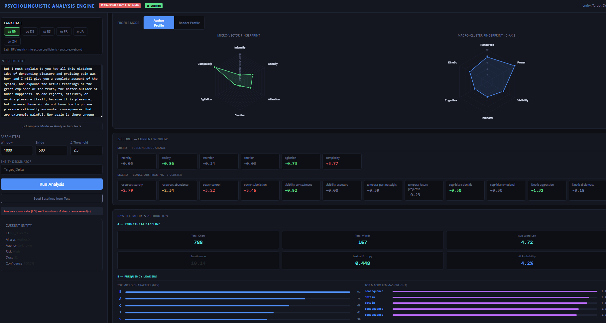
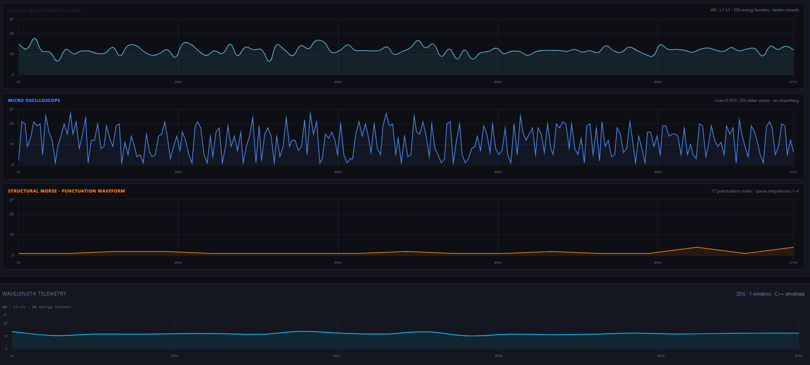
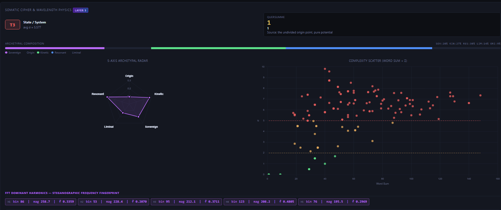

# PsychoLinguistic Analysis Engine v3.3

A real-time psycholinguistic profiling system that detects **steganographic layering**, **subconscious signal patterns**, and **authorial intent divergence** in text. Combines a compiled C++20 orthographic core with spaCy vector-similarity macro analysis and a full Somatic/Archetypal Cipher layer across six languages.

---

## Interface


*Main dashboard: language selector (EN/DE/ES/FR/JA/ZH), intercept text input, Steganography Risk chip, Author/Reader profile toggle, Micro-Vector Fingerprint radar (6 subconscious axes), Macro-Cluster Fingerprint radar (6 semantic clusters), Z-score dashboard (6 micro + 12 macro poles), and Raw Telemetry Section A (structural baseline — Total Chars, Total Words, Avg Word Length, Burstiness σ, Lexical Entropy, AI Probability).*


*Four aligned waveform panels sharing a common linear character-position x-axis: Global Waveform Envelope (100 energy buckets, Bézier smooth), Micro Oscilloscope (256 raw letter values, no smoothing), Structural Morse – Punctuation Waveform (neon amber stepped waveform, pause magnitudes 1–4), and Wavelength Telemetry (20-bucket C++ energy envelope per window).*


*Layer 3 Somatic Cipher & Wavelength Physics: complexity tier badge (T3 State/System, avg σ = 5.577), Quersumme archetype (1 — Source: the undivided origin point, pure potential), five-category Archetypal Composition bar (SOV/KIN/RES/LIM/ORI), 5-Axis Archetypal Radar, Complexity Scatter plot (word sum vs. σ, T1/T2/T3 color-coded), and FFT Dominant Harmonics steganographic frequency fingerprint (top 5 bins with magnitude and normalized frequency).*

---

## What It Does

The engine runs every text window through three independent analysis layers and measures the divergence between them:

| Layer | What it measures |
|---|---|
| **Micro (subconscious)** | Orthographic pressure — how letters *look and sound* at a subconscious level, scored via Base Psychological Vectors (BPV) |
| **Macro (conscious)** | Semantic framing — which psychological clusters a text gravitates toward, scored via spaCy cosine similarity |
| **Dissonance Engine** | Statistical divergence (Z-score delta) between the two layers — flags where the author's *conscious framing* contradicts their *subconscious signal* |
| **Somatic Cipher (Layer 3)** | Archetypal frequency analysis — maps every letter to a numeric value and archetypal category, runs an FFT on the resulting waveform to detect hidden rhythmic structures |

A high dissonance delta indicates one of three conditions: **Posturing** (conscious framing exceeds subconscious intensity), **Suppressed Signal** (subconscious leaks past conscious framing), or **Psychological Fracture** (extreme divergence consistent with AI-generated or dissociated text).

---

## Features

- **6-language analysis** — English, German, Spanish, French, Japanese, Chinese
- **C++20 compiled micro-core** — pybind11 BPV engine with `std::jthread` worker pool, zero-copy window sliding; EN/DE run natively, JA/ZH pass phonetic romanization through C++ for full BPV scoring
- **Universal Tokenization Override (JA/ZH)** — native morpheme/character counts from pykakasi (JA) and jieba (ZH) are used for structural telemetry; the phonetic Romaji/Pinyin string is passed to the C++ BPV engine so psychological vectors remain on the same A–Z basis as Latin languages
- **Chinese Dual-Signal Stroke-Count Physics Engine** — every Hanzi maps to a stroke count via a 150+ entry lookup table; the ordered `stroke_count_array` is returned per window as a physical ink-density signal; a sudden stroke-density spike signals a switch to complex ideograms — a prime indicator of hidden data or bureaucratic masking
- **C++ `analyze_with_strokes()`** — new pybind11 export injects the Python-computed stroke array into `WindowResult.structural_waveform` before serialization, allowing the C++ pipeline to pass through logographic density data without native Unicode parsing
- **C++ compiled somatic core** — modular pybind11 `_somatic_core` with Radix-2 FFT, letter table, and global envelope computation; also computes per-window energy envelopes returned in the API response
- **Vector similarity macro scoring** — spaCy `_md` models with cosine similarity against pre-built cluster centroids (25 seed words × 12 poles × 6 languages); falls back to exact-match on `_sm` models
- **Welford online baseline tracking** — running mean/σ per variable; statistically comparable Z-scores across documents
- **Somatic/Archetypal Cipher** — full A–Z letter-value matrix with 5 archetypal categories, Quersumme (digital root) archetype classification, 3-tier complexity system, and FFT harmonic detection
- **Three aligned waveform charts** — Global Waveform Envelope, Micro Oscilloscope, and Wavelength Telemetry all share the same linear char-position x-axis so features can be compared directly across charts
- **Dynamic Absolute-Length Scaling (Compare Mode)** — in comparison mode every chart's x-axis maximum is derived from `end_char − start_char` of the active window rather than the configured window size; each dataset is scaled independently to its own char count so windows of different lengths align correctly
- **Global waveform envelope** — 100-bucket compressed energy signal from the full document; per-window view slices the bucket range to the active window's char range
- **Micro oscilloscope** — up to 256 raw letter-value points, mapped proportionally across the window's full char range
- **Per-window energy envelope (C++)** — `window_envelope` (20 buckets) computed by the C++ somatic core for each analysis window and returned in the API response; used by the Wavelength Telemetry per-window panels
- **Wavelength Telemetry panels** — one chart per window, each showing its own energy envelope with an x-axis aligned to absolute char positions; only the active window's panel is visible at any time
- **Σ (Summary) mode** — dedicated overview pill showing the full document in all three waveform charts simultaneously
- **Invisible Unicode Scanner** — C++ `count_hidden_unicode()` and Python `_scan_hidden_unicode()` scan every window for zero-width characters (U+200B/C/D, U+2060, U+FEFF) and trailing whitespace before newlines; results surfaced as `hidden_unicode_count` and `stego_anomaly_flag` in `raw_telemetry`; the UI displays a red `⚠ STEGANOGRAPHIC ANOMALY` chip in the telemetry drawer when triggered
- **Punctuation Structural Morse Signal** — `build_punct_waveform()` maps every punctuation mark to a pause magnitude (`,`=1, `.`/`:`/`-`=2, `;`/em-dash=3, `!`/`?`=4) and returns the ordered `punctuation_waveform` array per window; rendered as a neon-amber stepped waveform in a dedicated somatic oscilloscope panel (compare mode: dual-dataset A+B overlay)
- **Linguistic Entropy Engine with Split-Stream Pipeline** — `entropy_engine.py` computes three AI-detection metrics per window: **burstiness** (σ of per-sentence word counts; human ≈ 6–12, AI ≈ 0–3), **lexical entropy** (unique lemmas / total lemmas), and **AI probability score** (composite 0.0–1.0: `burst_ai × 0.65 + entropy_ai × 0.35`); displayed as three stat boxes in the telemetry drawer with color-coded thresholds; a **Split-Stream Pipeline** forks every window into Stream A (raw text — untouched, routed to C++ telemetry, steganography scanner, punctuation waveform, and UI) and Stream B (`sanitize_for_entropy()` — Markdown stripped before NLP so headers, fenced code blocks, and bullet prefixes do not corrupt burstiness baselines)
- **Named Entity Targeting** — spaCy NER extracts GPE/ORG/PERSON entities from each window; each entity's containing sentence is scored against all 12 macro poles via `VectorClusterScorer.score_tokens()`; the dominant driver (cluster/pole) and weight are recorded; top-5 entities by weight are returned as `entity_polarity_map` and rendered in the new Section D of the telemetry drawer with color-coded label badges (GPE=cyan, ORG=purple, PERSON=amber)
- **Semantic Snippet Landmarks** — `snippetLandmark(win)` extracts the first 3 words of `start_snippet` + `…` for every window; the **Window Span Map** displays the landmark as a sub-line below each proportional bar (`"The strategic withdrawal…" (chars 0–1000)`); **Window Pills** include the landmark in their hover `title` attribute for quick orientation without selecting the window
- **Window Span Map** — proportional char-range timeline below the window pills showing exactly which character range each window covers; click any bar to jump to that window
- **Letter Frequency Panel with Inline Micro-Bars** — per-window A–Z frequency list with center-anchored background bars in compare mode: Text A bars grow right-to-left in neon blue (`rgba(0,255,255,0.15)`), Text B bars grow left-to-right in crimson (`rgba(220,20,60,0.15)`); counts and delta remain fully opaque above the bars; pre-computed phonetic frequency dicts (from `raw_telemetry.letter_frequencies`) ensure correct A–Z scoring for JA/ZH
- **Sparkline bar charts with window labels** — Micro Z↑, Macro Z↑, and Somatic σ summary bars are labelled W0/W1/W2… and clickable to jump to that window
- **FFT spectral analysis** — Radix-2 Cooley-Tukey FFT with DC offset removal; returns top 5 harmonic peaks (bin, magnitude, normalized frequency)
- **Author / Reader profile toggle** — Reader Profile inverts the Z-score space to model the psychological deficits the target audience brings to the text
- **Raw Telemetry drawer** — structural baseline (chars/words/avg length), BPV character frequency bars, double-letter anomaly chips, full 12-pole driver matrix; v3.3 additions: steganographic anomaly warning chip, three entropy stat boxes (Burstiness σ, Lexical Entropy, AI Probability), and Entity Polarity Map (Section D)
- **Bulk export** — JSON (full telemetry, all windows) and flat CSV (SPSS/R compatible)
- **Entity ledger** — persistent JSON database tracking baseline drift and dissonance event history across sessions
- **Rolling window tokenizer** — structural boundary detection (double newlines, chapter/section headings) with configurable window size and stride

---

## Architecture

```
psycholinguistic/
├── main.py                        # FastAPI app entry point
├── api/
│   ├── routes.py                  # REST endpoints + pipeline orchestration
│   │                              # computes per-window letter_frequencies (phonetic for JA/ZH)
│   └── compare_routes.py          # Compare-mode endpoints
├── language/
│   ├── router.py                  # Language factory + analyzer cache (6 languages)
│   └── registry.py                # spaCy model registry with _md/_sm fallback
├── micro_layer/
│   ├── base_analyzer.py           # MicroResult + BaseMicroAnalyzer ABC
│   ├── cpp_analyzer.py            # C++ adapter (EN, DE) with Python fallback
│   ├── orthographic_analyzer.py   # Python BPV pipeline (EN baseline)
│   ├── de_analyzer.py             # German: umlaut/ß normalisation → BPV
│   ├── es_analyzer.py             # Spanish: RR×2.0 / LL×1.5 overrides
│   ├── fr_analyzer.py             # French: silent terminal suppression
│   ├── ja_analyzer.py             # Japanese: logographic matrix + RomajiCppJapaneseAnalyzer
│   │                              # pykakasi → Hepburn Romaji → C++ BPV; native counts preserved
│   ├── zh_analyzer.py             # Chinese: jieba tokenization + pypinyin → Pinyin → C++ BPV
│   │                              # Hanzi stroke-count array (Dual-Signal Physics Engine)
│   └── somatic_engine.py          # Layer 3: Somatic Cipher, FFT, envelope (Python + C++ bridge)
├── macro_layer/
│   ├── semantic_analyzer.py       # VectorClusterScorer + SemanticAnalyzer (EN)
│   ├── multilingual_analyzer.py   # Generic multilingual wrapper
│   ├── {en,de,es,fr,ja}_clusters.py  # 25 words × 12 poles per language
│   ├── ja_clusters.py             # JapaneseSemanticAnalyzer + Keigo formality
│   └── zh_clusters.py             # ChineseSemanticAnalyzer + jieba tokenization
├── entropy_engine.py              # Linguistic Entropy Engine: burstiness, lexical entropy, AI probability
├── dissonance/
│   └── engine.py                  # Welford stats + Z-scores + EMA + event detection
├── tokenizer/
│   └── rolling_window.py          # Structural boundary tokenizer
├── database/
│   └── schema.py                  # Entity JSON DB helpers
├── cpp_core/                      # C++20 pybind11 BPV module (psycho_core)
│   ├── include/
│   │   ├── types.h                # WindowResult: structural_waveform, hidden_unicode_count, stego_anomaly_flag, punctuation_waveform
│   │   ├── bpv_table.h
│   │   ├── micro_analyzer.h
│   │   ├── window_engine.h
│   │   ├── pipeline.h
│   │   ├── compare_engine.h
│   │   └── thread_pool.h
│   ├── src/
│   │   ├── micro_analyzer.cpp
│   │   ├── window_engine.cpp
│   │   ├── pipeline.cpp           # includes count_hidden_unicode() + build_punct_waveform()
│   │   ├── compare_engine.cpp
│   │   ├── thread_pool.cpp        # std::jthread C++20 worker pool (RAII, stop_token)
│   │   └── bindings.cpp           # exports analyze() + analyze_with_strokes(); VERSION 3.3.0
│   ├── CMakeLists.txt
│   ├── setup.py                   # pip-installable build (macOS / Linux)
│   └── build_release.bat          # Windows build (VS2022 Build Tools + CMake + Ninja)
├── cpp/                           # C++17 pybind11 Somatic Core module (_somatic_core)
│   ├── types.h
│   ├── letter_table.h / .cpp      # Compile-time A–Z value/category table + umlaut lookup
│   ├── fft.h / .cpp               # Radix-2 Cooley-Tukey FFT with DC offset removal
│   ├── somatic_analyzer.h / .cpp  # UTF-8 tokenizer, word scoring, envelope computation
│   ├── bindings.cpp               # pybind11 exports: analyze(), compute_global_envelope()
│   ├── CMakeLists.txt
│   ├── setup.py
│   └── build.sh
├── templates/
│   └── index.html                 # Single-page analysis dashboard (Chart.js, vanilla JS)
└── entity_db.json                 # Persistent entity + baseline store
```

---

## Dashboard Panels

### Window Selection & Span Map

Below the run controls, a row of **window pills** (W0, W1, W2 …) lets you jump between analysis windows. Hovering any pill shows a tooltip with the character/line range, the 3-word **semantic snippet landmark** (`"The strategic withdrawal…"`), and the reset reason. Beneath the pills, a **Window Span Map** renders a proportional bar for each window; below each bar a sub-line displays the snippet landmark and exact character range (`"The strategic withdrawal…" (chars 0–1000)`) so windows are immediately identifiable without selecting them. Clicking any bar or pill selects that window and updates all charts.

The special **Σ pill** activates summary mode — all three waveform charts switch to full-document view and all analysis cards are shown together for a quick overview.

### Three Aligned Waveform Charts

All three charts share a **linear character-position x-axis** with identical bounds for the active window, making cross-chart comparison possible:

| Chart | Data source | Resolution | Rendering |
|---|---|---|---|
| **Global Waveform Envelope** | `global_waveform_envelope` (100 buckets, full document) sliced to active window's char range | 100 buckets total, proportionally distributed | Bezier smooth, filled |
| **Micro Oscilloscope** | `micro_wavelength` (up to 256 raw letter values per window), mapped proportionally across `start_char → end_char` | Up to 256 points | Sharp line, no smoothing |
| **Wavelength Telemetry** | `window_envelope` (20-bucket C++ envelope for this window's exact text) | 20 buckets | Bezier smooth, filled |

In **Σ summary mode** all three charts display the full document:
- Global Waveform: all 100 buckets from `0` to `totalChars`
- Micro Oscilloscope: all windows' letter values concatenated end-to-end, each window's letters mapped proportionally to its char range
- Wavelength Telemetry: single full-document chart using the global 100-bucket envelope

### Letter Frequency Panel

Shows the A–Z letter distribution for the currently selected window. In compare mode, each row displays **inline micro-bars**: a semi-transparent cyan fill behind Text A's count growing right-to-left, and a crimson fill behind Text B's count growing left-to-right, meeting at a center divider showing the letter and signed delta. Both bars are scaled relative to the absolute maximum frequency across both texts. In Σ mode the panel shows the full document.

For JA and ZH, frequencies are computed from the phonetic romanization (Romaji/Pinyin) stored in `raw_telemetry.letter_frequencies` by the backend, so A–Z counts correctly reflect the BPV input rather than native glyphs.

### Chinese Script Panel (ZH)

When the active window is Chinese, a dedicated **ZH script panel** shows:
- **Hanzi count** — total ideographic characters in the window
- **Avg strokes** — mean Hanzi stroke count (ink density)
- **Max strokes** — heaviest single character in the window
- **Complexity index** — stroke density as a percentage of the maximum observable (26 strokes)

Below the panel, the **Dual-Signal Stroke-Count Oscilloscope** renders `stroke_count_array` as a waveform in neon gold (`rgba(255,215,0,1)`), one data point per Hanzi in document order. In compare mode both Text A and Text B are rendered with Dynamic Absolute-Length Scaling.

---

## Layer 3: Somatic / Archetypal Cipher

### Letter Value Matrix

Each letter maps to an exact numeric value and an **archetypal category**:

| Letter | Value | Category | | Letter | Value | Category |
|--------|-------|----------|-|--------|-------|----------|
| A | 1 | Origin | | N | 14 | Liminal |
| B | 2 | Kinetic | | O | 15 | Resonant |
| C | 3 | Resonant | | P | 16 | Kinetic |
| D | 4 | Sovereign | | Q | 17 | Sovereign |
| E | 5 | Kinetic | | R | 18 | Liminal |
| F | 6 | Kinetic | | S | 19 | Kinetic |
| G | 7 | Liminal | | T | 20 | Sovereign |
| H | 8 | Resonant | | U | 21 | Resonant |
| I | 9 | Sovereign | | V | 22 | Kinetic |
| J | 10 | Kinetic | | W | 23 | Sovereign |
| K | 11 | Sovereign | | X | 24 | Sovereign |
| L | 12 | Resonant | | Y | 25 | Resonant |
| M | 13 | Resonant | | Z | 26 | Sovereign |

German umlauts receive intermediate values: **Ä = 1.5** (Liminal), **Ö = 15.5** (Liminal), **Ü = 21.5** (Liminal).

### Quersumme (Digital Root) Archetypes

The Quersumme is the digital root of a word's total letter-value sum: `n % 9`, with 9 returned for multiples of 9.

| QS | Archetype |
|----|-----------|
| 1 | Source |
| 2 | Bond |
| 3 | Overflow |
| 4 | Foundation |
| 5 | Friction |
| 6 | Grounding |
| 7 | Precursor |
| 8 | Infinity / State |
| 9 | Transcendent |

### Complexity Tiers

Tier is determined by the **population standard deviation** (σ) of the letter values within each word:

| Tier | σ Range | Label |
|------|---------|-------|
| T1 | σ < 2.0 | Somatic / Universal |
| T2 | 2.0 ≤ σ < 5.0 | Archetypal Bridge |
| T3 | σ ≥ 5.0 | State / System |

### FFT Spectral Analysis

Before running the FFT on the 256-letter micro array, the engine subtracts the **mean of the real (non-padded) samples** from every value. This eliminates the DC offset — without removal, the average English letter value (~13.5) would cause spectral leakage that artificially dominates low-frequency bins (1–5) and masks genuine rhythmic structures.

The Radix-2 Cooley-Tukey FFT then returns the **top 5 harmonic peaks** (bin index, magnitude, and normalized frequency) from bins 1 through N/2−1. The identical DC removal logic is implemented in both the C++ core and the Python fallback.

---

## Language Support

| Code | Language | Micro Pipeline | Somatic Input | Macro Model | Notes |
|---|---|---|---|---|---|
| EN | English | C++ BPV core | A–Z letter values | `en_core_web_md` | Full C++ acceleration |
| DE | German | C++ BPV + umlaut/ß normalisation | A–Z + Ä/Ö/Ü values | `de_core_news_md` | ä→ae ö→oe ü→ue for BPV; Ä/Ö/Ü scored as 1.5/15.5/21.5 in somatic |
| ES | Spanish | Python BPV + RR×2.0 / LL×1.5 | A–Z letter values | `es_core_news_md` | Vibrante múltiple override |
| FR | French | Python BPV + silent terminal (S/T/X/D→0) | A–Z letter values | `fr_core_news_md` | Psychological trail-off model |
| JA | Japanese | `RomajiCppJapaneseAnalyzer`: pykakasi → Hepburn Romaji → C++ BPV; native script counts preserved | Hepburn romanization | `ja_core_news_md` | Script ratios (kanji/hiragana/katakana) and stroke density stored separately; logographic counts override C++ structural baseline |
| ZH | Chinese | `ChineseOrthographicAnalyzer`: jieba tokenization → pypinyin → Pinyin → C++ BPV; Hanzi stroke array computed in parallel | Pinyin romanization | `zh_core_web_md` | Dual-Signal Engine: stroke-count waveform passed to C++ via `analyze_with_strokes()`; native jieba counts override structural baseline |

---

## Macro Clusters (all languages)

Each language has 25 seed words per pole (300 total), used to build L2-normalized centroid vectors for cosine similarity scoring.

| Cluster | Primary Pole | Opposing Pole |
|---|---|---|
| Resources | Scarcity | Abundance |
| Power | Control | Submission |
| Visibility | Concealment | Exposure |
| Temporal | Future Projective | Past Nostalgic |
| Cognitive | Scientific | Emotional |
| Kinetic | Aggression | Diplomacy |

---

## Installation

**Requirements:** Python 3.9+, pip

```bash
# 1. Clone and install Python dependencies
pip install -r requirements.txt

# 2. Install all vector-enabled spaCy models
python -m spacy download en_core_web_md
python -m spacy download de_core_news_md
python -m spacy download es_core_news_md
python -m spacy download fr_core_news_md
python -m spacy download ja_core_news_md
python -m spacy download zh_core_web_md
```

`requirements.txt` includes: `fastapi`, `uvicorn`, `spacy`, `numpy>=1.24.0`, `pybind11>=2.11.0`, `pykakasi>=2.2.1`, `jieba>=0.42.1`, `pypinyin>=0.49.0`.

> The engine falls back to `_sm` models automatically if an `_md` model is unavailable, and falls back to exact-match scoring if the model has no word vectors. The Python somatic fallback (numpy FFT) is used automatically if `_somatic_core` is not compiled. For ZH, `analyze_with_strokes()` is used when available (psycho_core ≥ 3.2); otherwise `analyze()` is used and the stroke array is omitted from C++ output.

---

## Building the C++ BPV Core (`psycho_core`)

The BPV core accelerates EN/DE micro-layer analysis and provides the `analyze_with_strokes()` passthrough for JA/ZH phonetic strings. The Python fallback is used automatically if not compiled.

### macOS / Linux

```bash
pip install pybind11

# In-place development build (module lands next to main.py)
cd cpp_core
MACOSX_DEPLOYMENT_TARGET=11.0 python setup.py build_ext --inplace
```

> **macOS note:** `MACOSX_DEPLOYMENT_TARGET=11.0` is required. The C++20 types `std::jthread` and `std::stop_token` used by the thread pool are only available on macOS 11.0+. Without this flag, Apple Clang defaults to targeting macOS 10.9, causing "unavailable" compile errors.

Alternatively, build with CMake:

```bash
cd cpp_core
cmake -B build -DCMAKE_BUILD_TYPE=Release
cmake --build build --config Release -j
cmake --install build --prefix ..
```

### Windows

Requires Visual Studio 2022 Build Tools with the C++ workload and CMake + Ninja.

```bat
cd cpp_core
build_release.bat
```

The compiled `psycho_core.*.pyd` is installed to the project root automatically.

### C++ BPV module structure

| File | Responsibility |
|---|---|
| `src/pipeline.cpp` | Shared single-document BPV scoring pipeline; used by both single and compare modes |
| `src/compare_engine.cpp` | Side-by-side dual-document analysis for Compare Mode |
| `src/window_engine.cpp` | Rolling window tokenizer with structural boundary detection |
| `src/micro_analyzer.cpp` | Per-letter BPV scoring with interaction coefficients |
| `src/thread_pool.cpp` | C++20 `std::jthread` worker pool with `stop_token` RAII shutdown |
| `src/bindings.cpp` | pybind11 exports: `analyze()` + `analyze_with_strokes(text, window_size, stride, stroke_array)` |

---

## Building the C++ Somatic Core (`_somatic_core`)

The `_somatic_core` module accelerates the somatic cipher, FFT, global envelope computation, and per-window energy envelope computation. The Python/numpy fallback is used automatically if not compiled.

```bash
# Install build tools
pip install cmake pybind11

# Build (Unix/macOS)
cd cpp
bash build.sh

# Or via pip (any platform)
cd cpp
pip install .
```

The compiled `_somatic_core.*.so` (or `.pyd` on Windows) is placed in the project root. Once present, somatic analysis switches to the C++ backend automatically.

### C++ Somatic module structure

| File | Responsibility |
|---|---|
| `letter_table.cpp` | Compile-time A–Z value/category lookup array; 2-byte UTF-8 umlaut handler |
| `fft.cpp` | Radix-2 Cooley-Tukey in-place FFT; `dominant_harmonics()` with DC offset removal |
| `somatic_analyzer.cpp` | UTF-8 tokenizer; word scoring; 256-point micro waveform; 100-bucket global envelope; per-window envelope |
| `bindings.cpp` | pybind11 exports: `analyze(text) → dict`, `compute_global_envelope(text, n_buckets) → list[float]` |

---

## Running

```bash
python main.py
```

Open `http://localhost:8000` in a browser.

**Workflow:**
1. Select language
2. *(Optional)* Paste a reference/control text and click **Seed Baselines from Text** to anchor the statistical baseline
3. Paste the intercept text and set an entity designator
4. Click **Run Analysis**
5. Click any window pill (W0, W1 …) to inspect that window's micro/macro fingerprint, Z-scores, somatic cipher, and all three aligned waveform charts
6. Click the **Σ pill** for a full-document summary with all analysis cards and full-document waveforms
7. Use the **Window Span Map** below the pills to see at a glance which character range each window covers
8. Toggle **Reader Profile** to switch from authorial signal analysis to target audience profiling
9. Export results via **↓ JSON** or **↓ CSV**

---

## API

| Method | Endpoint | Description |
|---|---|---|
| `POST` | `/api/analyze` | Run full pipeline on submitted text |
| `POST` | `/api/control` | Seed statistical baselines from a reference text |
| `GET` | `/api/entity` | Fetch current entity record |
| `POST` | `/api/entity` | Create / overwrite entity record |
| `GET` | `/api/entity/ledger` | Retrieve dissonance event ledger |
| `DELETE` | `/api/entity/ledger` | Clear ledger |
| `GET` | `/api/languages` | List supported language codes |
| `GET` | `/api/health` | Liveness check + loaded model list |

**Example request:**
```json
POST /api/analyze
{
  "text": "The strategic withdrawal consolidates resources under centralized authority.",
  "language_code": "EN",
  "window_size": 1000,
  "stride": 500,
  "dissonance_threshold": 2.5
}
```

**Top-level response fields:**

```json
{
  "document_id": "doc_a3f9b1",
  "language": "EN",
  "total_windows": 3,
  "global_waveform_envelope": [8.2, 11.4, 9.7, ...],
  "windows": [...]
}
```

`global_waveform_envelope` — 100 floats representing the full-document energy envelope. Each bucket is the average letter value over 1/100th of the document's letters.

**Per-window somatic fields** (`windows[n].somatic`):

```json
{
  "avg_word_sigma": 3.42,
  "dominant_quersumme": 7,
  "quersumme_archetype": "7 — Precursor: the liminal threshold before emergence",
  "tier_code": "T2",
  "tier_label": "Archetypal Bridge",
  "sovereignty_score": 0.38,
  "resonant_score": 0.21,
  "kinetic_score": 0.19,
  "liminal_score": 0.14,
  "somatic_score": 0.08,
  "category_counts": {"sovereign": 38, "resonant": 21, ...},
  "top_harmonics": [
    {"bin": 11, "magnitude": 191.6, "norm_freq": 0.043},
    {"bin": 49, "magnitude": 178.2, "norm_freq": 0.191}
  ],
  "micro_wavelength": [1.0, 19.0, 20.0, ...],
  "window_envelope": [8.3, 12.1, 9.4, ...]
}
```

`window_envelope` — 20 floats computed by the C++ somatic core from this window's text only. Each bucket is the average letter value over 1/20th of the window's letters.

**Per-window raw telemetry fields** (`windows[n].raw_telemetry`):

```json
{
  "total_chars": 847,
  "total_words": 142,
  "avg_word_length": 5.96,
  "top_micro_chars": {"E": 91, "T": 72, "A": 68, "O": 61, "I": 58},
  "double_letter_anomalies": {"LL": 3, "SS": 2},
  "macro_drivers": {"resources_scarcity": {"lack": 1.4, "shortage": 0.9}},
  "letter_frequencies": {"A": 68, "B": 12, "C": 29, ...},
  "stroke_count_array": [8, 13, 4, 11, ...],
  "hidden_unicode_count": 0,
  "stego_anomaly_flag": false,
  "punctuation_waveform": [1, 2, 1, 4, 2, 3, ...],
  "sentence_count": 8,
  "burstiness": 6.42,
  "lexical_entropy": 0.71,
  "ai_probability_score": 0.18
}
```

`letter_frequencies` — full A–Z frequency dict for the window. For JA/ZH this is computed from the phonetic romanization (Romaji/Pinyin) so the distribution reflects the BPV alphabet rather than native glyphs.

`stroke_count_array` — ZH only. Ordered list of stroke counts for every Hanzi in the window, in document order. Drives the Dual-Signal Stroke-Count Physics oscilloscope in the UI.

`hidden_unicode_count` / `stego_anomaly_flag` — count of zero-width Unicode characters (U+200B/C/D, U+2060, U+FEFF) and trailing whitespace before newlines in the window. Flag is `true` when count > 0.

`punctuation_waveform` — ordered array of pause magnitudes for every punctuation mark in the window: `,`=1, `.`/`:`/`-`=2, `;`/em-dash=3, `!`/`?`=4. Drives the neon-amber Punctuation Structural Morse oscilloscope.

`burstiness` — population σ of per-sentence word counts. Human text ≈ 6–12; AI-generated text ≈ 0–3 (flat rhythm).

`lexical_entropy` — unique lemmas / total lemmas. AI-generated text tends toward 0.65–0.85 (broad shallow vocabulary).

`ai_probability_score` — composite 0.0–1.0 signal: `burst_ai × 0.65 + entropy_ai × 0.35` where `burst_ai = max(0, 1 − σ/10)` and `entropy_ai = max(0, min(1, (entropy − 0.4) / 0.4))`. Displayed in amber (>0.40) or red (>0.65) in the UI.

**Per-window macro fields** (`windows[n].macro`):

```json
{
  "cluster_scores": {
    "power": {"control": 0.042, "submission": 0.011},
    ...
  },
  "total_words": 142,
  "entity_polarity_map": [
    {"entity": "NATO", "label": "ORG",    "driver": "power/control",       "weight": 0.8812},
    {"entity": "Berlin", "label": "GPE",  "driver": "temporal/past_nostalgic", "weight": 0.7634},
    {"entity": "Merkel", "label": "PERSON","driver": "kinetic/diplomacy",  "weight": 0.7201}
  ]
}
```

`entity_polarity_map` — top-5 named entities (GPE/ORG/PERSON) from the window, each mapped to the dominant macro cluster/pole by scoring the entity's containing sentence. Rendered in the telemetry drawer Section D with color-coded badges.

**Per-window spatial fields:**

```json
{
  "window_index": 0,
  "start_char": 0,
  "end_char": 1000,
  "start_line": 1,
  "end_line": 12,
  "start_snippet": "The strategic withdrawal consolidates",
  "end_snippet": "under centralized authority"
}
```

---

## How the Dissonance Engine Works

For each analysis window the engine:

1. Updates a **Welford online mean/σ** for every micro and macro variable
2. Computes **Z-scores** — how many standard deviations each observation sits from the running baseline
3. Tracks an **EMA** (α = 0.1) for drift visualization
4. Evaluates **11 semantic bridge pairs** that link micro vectors to macro poles (e.g. `intensity ↔ power_control`, `emotion ↔ cognitive_emotional`)
5. Fires a **DissonanceEvent** when |Z_macro − Z_micro| exceeds the configured threshold (default 2.5σ)
6. Classifies the event: *Posturing*, *Suppressed Signal*, or *Psychological Fracture*

Events are persisted to the entity ledger and accumulate a **baseline confidence score** across sessions.

---

## Changelog

### v3.3
- **Invisible Unicode Scanner** — C++ `count_hidden_unicode()` in `pipeline.cpp` scans UTF-8 bytes for zero-width characters (U+200B/C/D `E2 80 8B/8C/8D`, U+2060 `E2 81 A0`, U+FEFF `EF BB BF`) and trailing whitespace before newlines; `hidden_unicode_count` and `stego_anomaly_flag` added to `WindowResult` (C++), `MicroResult.raw` (Python adapter), and `raw_telemetry` (API response); parallel Python `_scan_hidden_unicode()` in `routes.py` handles all languages including JA/ZH phonetic paths; UI shows a red `⚠ STEGANOGRAPHIC ANOMALY — N hidden Unicode characters detected` chip in the telemetry drawer
- **Punctuation Structural Morse Signal** — C++ `build_punct_waveform()` and Python `_build_punct_waveform()` produce an ordered array of pause magnitudes per punctuation mark (`,`=1, `.`/`:`/`-`=2, `;`/em-dash=3, `!`/`?`=4); returned as `punctuation_waveform` in `raw_telemetry`; rendered as a neon-amber stepped waveform in a new Somatic Panel D (`soma-punct`); compare mode shows dual-dataset A/B overlay
- **Linguistic Entropy Engine + Split-Stream Pipeline** (`entropy_engine.py`) — `compute_entropy_metrics(text, lemmas)` computes burstiness, lexical entropy, and AI probability; a **Split-Stream Pipeline** forks each window in `routes.py`: **Stream A** (`win.text`, raw) is passed unchanged to the steganography scanner, punctuation waveform builder, C++ telemetry, and UI; **Stream B** (`sanitize_for_entropy(win.text)`) strips fenced code blocks (` ``` `), inline code, horizontal rules, and all Markdown line prefixes (`#`, `*`, `-`, `>`, `=>`, `|`) via six pre-compiled module-level patterns before the text reaches spaCy sentence segmentation — eliminating artificial burstiness variance from document structure; stego and punct analysers intentionally remain on Stream A since hidden Unicode in headers and bullet commas are valid detection targets
- **Named Entity Targeting** — `extract_entity_polarity()` in `macro_layer/semantic_analyzer.py` runs spaCy NER on every analysis window, scores each GPE/ORG/PERSON entity's containing sentence against all 12 macro poles via `VectorClusterScorer.score_tokens()`, and records the dominant driver (cluster/pole, weight); top-5 entities returned as `entity_polarity_map` in `windows[n].macro`; rendered in telemetry drawer Section D with color-coded label badges; also integrated into `MultilingualSemanticAnalyzer` via shared `extract_entity_polarity()` helper
- **Semantic Snippet Landmarks** — `snippetLandmark(win)` JS helper extracts the first 3 words of `start_snippet` + `…` for every window; **Window Span Map** rows gain a `.wsm-snippet` sub-line showing `"The strategic withdrawal…" (chars 0–1000)`; **Window Pills** include the landmark in their `title` hover tooltip alongside the line/char range and reset reason

### v3.2
- **Chinese (ZH) language support** — full six-layer pipeline: jieba word tokenization, pypinyin Pinyin romanization, C++ BPV scoring, spaCy `zh_core_web_md` macro analysis, Hanzi stroke-count array, and ZH script panel in the UI
- **Universal Tokenization Override (JA/ZH)** — native morpheme/character counts from pykakasi (JA) and jieba (ZH) replace C++ structural baseline in `raw_telemetry`; phonetic Romaji/Pinyin string is passed to C++ BPV so psychological vectors remain cross-language comparable
- **Dual-Signal Stroke-Count Physics Engine** — `stroke_count_array` (one int per Hanzi, ordered) computed from a 150+ entry lookup table and returned per window; drives a dedicated neon-gold oscilloscope in the UI with compare-mode dual-dataset support
- **C++ `analyze_with_strokes()`** — new pybind11 export in `psycho_core` v3.2.0; injects a Python-computed `std::vector<int>` stroke array into `WindowResult.structural_waveform` before serialization, allowing logographic density data to pass through the C++ pipeline without native Unicode parsing
- **Letter frequency phonetic routing** — `routes.py` computes `letter_frequencies` from the phonetic text (`phonetic_text` in `micro_result.raw`) for JA/ZH, and from raw window text for all others; stored in `raw_telemetry` and consumed directly by the frontend, eliminating the previous zero-count bug for logographic languages in both single and compare modes
- **Dynamic Absolute-Length Scaling (Compare Mode)** — all comparison charts now use `actualCharCount = end_char − start_char` as the x-axis maximum; each dataset is independently scaled to its own char count so windows of different lengths align correctly across texts
- **Inline Micro-Bars in Letter Frequency compare view** — replaced stacked track bars with center-anchored background fills: Text A cyan (`rgba(0,255,255,0.15)`) anchored right, Text B crimson (`rgba(220,20,60,0.15)`) anchored left; counts and signed delta remain fully opaque on `z-index:1`

### v3.1
- **Unified x-axis across all three waveform charts** — Global Waveform Envelope, Micro Oscilloscope, and Wavelength Telemetry now all use a `type: 'linear'` Chart.js scale with identical `min`/`max` bounds (absolute char positions) per window
- **Micro Oscilloscope proportional mapping** — letter values mapped proportionally across the full `start_char → end_char` range; the oscilloscope line always spans the complete x-axis
- **Per-window energy envelope from C++** — `window_envelope` (20 buckets) added to the API response per window, computed by `_somatic_core.compute_global_envelope()` on the window text
- **Wavelength Telemetry `TelwModule`** — telemetry JS refactored into `_telwBuildWindowPanels`, `_telwBuildFullDocChart`, `_telwShowActivePanel`, `_telwDestroyChunks`
- **Full-document telemetry chart in Σ mode** — summary mode shows a single full-document Wavelength Telemetry chart (100 buckets, x: 0→totalChars)
- **macOS C++ build fix** — `MACOSX_DEPLOYMENT_TARGET=11.0` required for `std::jthread` / `std::stop_token`

### v3.0
- **Wavelength Telemetry per-window panels** — one Chart.js line chart per analysis window with linear x-axis
- **Window Span Map** — proportional bar chart below window pills showing character range for each window; clickable to navigate
- **Σ (Summary) mode** — overview pill with all analysis cards aggregated across the full document
- **Per-window letter frequency** — letter frequency panel updates to the active window's character range
- **Chart.js fixed-height wrappers** — all oscilloscope canvases wrapped in `position:relative; height:Npx` containers

### v2.1
- C++ core (`psycho_core`) with pipeline, compare engine, and `std::jthread` thread pool
- Vector similarity macro scoring with spaCy `_md` models
- German language support with umlaut BPV normalisation
- Raw telemetry drawer (structural, frequency, driver matrix)
- Global waveform envelope and micro oscilloscope (initial implementation)
