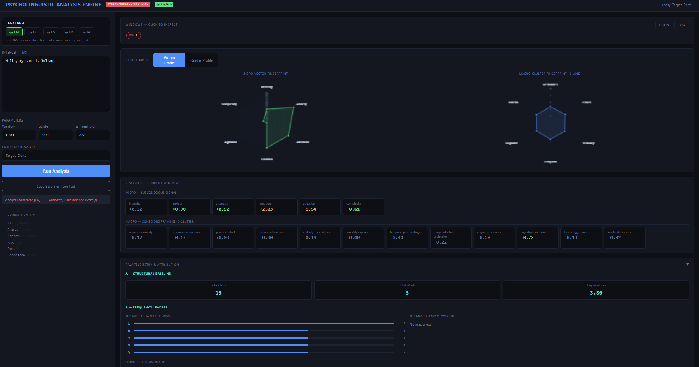
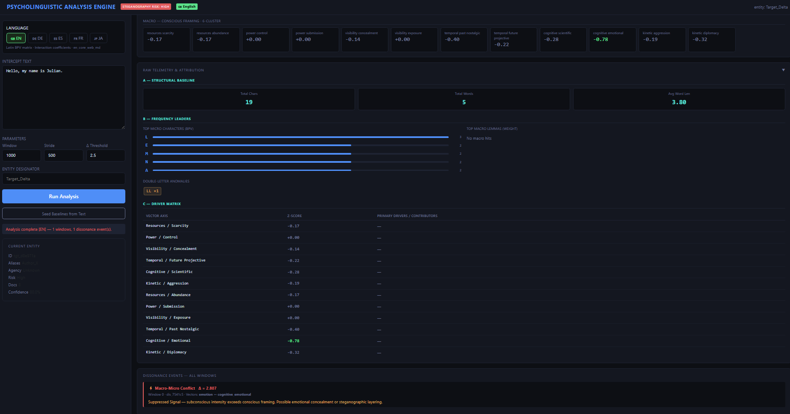

# PsychoLinguistic Analysis Engine v3.1

A real-time psycholinguistic profiling system that detects **steganographic layering**, **subconscious signal patterns**, and **authorial intent divergence** in text. Combines a compiled C++20 orthographic core with spaCy vector-similarity macro analysis and a full Somatic/Archetypal Cipher layer across five languages.

---

## Interface


*Micro-vector fingerprint radar, macro-cluster fingerprint, Z-score dashboard, Layer 3 somatic cipher, and aligned waveform oscilloscopes.*


*Raw Telemetry drawer: Section A (structural baseline), Section B (frequency leaders + double-letter anomalies), Section C (driver matrix — all 12 macro poles with Z-scores and contributing lemmas).*

---

## What It Does

The engine runs every text window through three independent analysis layers and measures the divergence between them:

| Layer | What it measures |
|---|---|
| **Micro (subconscious)** | Orthographic pressure — how letters *look and sound* at a subconscious level, scored via Base Psychological Vectors (BPV) |
| **Macro (conscious)** | Semantic framing — which psychological clusters a text gravitates toward, scored via spaCy cosine similarity |
| **Dissonance Engine** | Statistical divergence (Z-score delta) between the two layers — flags where the author's *conscious framing* contradicts their *subconscious signal* |
| **Somatic Cipher (Layer 3)** | Archetypal frequency analysis — maps every letter to a numeric value and archetypal category, runs an FFT on the resulting waveform to detect hidden rhythmic structures |

A high dissonance delta indicates one of three conditions: **Posturing** (conscious framing exceeds subconscious intensity), **Suppressed Signal** (subconscious leaks past conscious framing), or **Psychological Fracture** (extreme divergence consistent with AI-generated or dissociated text).

---

## Features

- **5-language analysis** — English, German, Spanish, French, Japanese
- **C++20 compiled micro-core** — pybind11 BPV engine with `std::jthread` worker pool, zero-copy window sliding, runs EN and DE at full speed
- **C++ compiled somatic core** — modular pybind11 `_somatic_core` with Radix-2 FFT, letter table, and global envelope computation; also computes per-window energy envelopes returned in the API response
- **Vector similarity macro scoring** — spaCy `_md` models with cosine similarity against pre-built cluster centroids (25 seed words × 12 poles × 5 languages); falls back to exact-match on `_sm` models
- **Welford online baseline tracking** — running mean/σ per variable; statistically comparable Z-scores across documents
- **Somatic/Archetypal Cipher** — full A–Z letter-value matrix with 5 archetypal categories, Quersumme (digital root) archetype classification, 3-tier complexity system, and FFT harmonic detection
- **Three aligned waveform charts** — Global Waveform Envelope, Micro Oscilloscope, and Wavelength Telemetry all share the same linear char-position x-axis so features can be compared directly across charts
- **Global waveform envelope** — 100-bucket compressed energy signal from the full document; per-window view slices the bucket range to the active window's char range
- **Micro oscilloscope** — up to 256 raw letter-value points, mapped proportionally across the window's full char range so the line always spans the same x extent as the other charts
- **Per-window energy envelope (C++)** — `window_envelope` (20 buckets) computed by the C++ somatic core for each analysis window and returned in the API response; used by the Wavelength Telemetry per-window panels
- **Wavelength Telemetry panels** — one chart per window, each showing its own energy envelope with an x-axis aligned to absolute char positions; only the active window's panel is visible at any time
- **Σ (Summary) mode** — dedicated overview pill showing the full document in all three waveform charts simultaneously (all 100 envelope buckets, all windows' oscilloscope data concatenated, one full-doc telemetry chart)
- **Window Span Map** — proportional char-range timeline below the window pills showing exactly which character range each window covers; click any bar to jump to that window
- **Per-window letter frequency** — letter frequency and count chart updates to show only the characters within the currently selected window; Σ mode shows the full document
- **Sparkline bar charts with window labels** — the Micro Z↑, Macro Z↑, and Somatic σ summary bars are labelled W0/W1/W2… and clickable to jump to that window; the active window bar is highlighted white
- **FFT spectral analysis** — Radix-2 Cooley-Tukey FFT with DC offset removal; returns top 5 harmonic peaks (bin, magnitude, normalized frequency) from each window's letter waveform
- **Japanese Romaji bridge** — pykakasi converts Kanji/Kana to Hepburn romanization so the somatic A–Z engine can measure phonetic waveforms for Japanese text
- **Author / Reader profile toggle** — Reader Profile inverts the Z-score space to model the psychological deficits the target audience brings to the text
- **Raw Telemetry drawer** — structural baseline (chars/words/avg length), BPV character frequency bars, double-letter anomaly chips, full 12-pole driver matrix
- **Bulk export** — JSON (full telemetry, all windows) and flat CSV (SPSS/R compatible)
- **Entity ledger** — persistent JSON database tracking baseline drift and dissonance event history across sessions
- **Rolling window tokenizer** — structural boundary detection (double newlines, chapter/section headings) with configurable window size and stride

---

## Architecture

```
pyscholinguistic/
├── main.py                        # FastAPI app entry point
├── api/
│   ├── routes.py                  # REST endpoints + pipeline orchestration
│   │                              # also computes per-window window_envelope via C++
│   └── compare_routes.py          # Compare-mode endpoints
├── language/
│   ├── router.py                  # Language factory + analyzer cache
│   └── registry.py                # spaCy model registry with _md/_sm fallback
├── micro_layer/
│   ├── base_analyzer.py           # MicroResult + BaseMicroAnalyzer ABC
│   ├── cpp_analyzer.py            # C++ adapter (EN, DE) with Python fallback
│   ├── orthographic_analyzer.py   # Python BPV pipeline (EN baseline)
│   ├── de_analyzer.py             # German: umlaut/ß normalisation → BPV
│   ├── es_analyzer.py             # Spanish: RR×2.0 / LL×1.5 overrides
│   ├── fr_analyzer.py             # French: silent terminal suppression
│   ├── ja_analyzer.py             # Japanese: logographic matrix + Keigo
│   ├── ja_romaji_bridge.py        # pykakasi bridge: Kanji/Kana → Hepburn romanization
│   └── somatic_engine.py          # Layer 3: Somatic Cipher, FFT, envelope (Python + C++ bridge)
├── macro_layer/
│   ├── semantic_analyzer.py       # VectorClusterScorer + SemanticAnalyzer (EN)
│   ├── multilingual_analyzer.py   # Generic multilingual wrapper
│   ├── {en,de,es,fr,ja}_clusters.py  # 25 words × 12 poles per language
│   └── ja_clusters.py             # Also contains JapaneseSemanticAnalyzer + Keigo
├── dissonance/
│   └── engine.py                  # Welford stats + Z-scores + EMA + event detection
├── tokenizer/
│   └── rolling_window.py          # Structural boundary tokenizer
├── database/
│   └── schema.py                  # Entity JSON DB helpers
├── cpp_core/                      # C++20 pybind11 BPV module (EN/DE micro layer)
│   ├── include/
│   │   ├── types.h
│   │   ├── bpv_table.h
│   │   ├── micro_analyzer.h
│   │   ├── window_engine.h
│   │   ├── pipeline.h
│   │   ├── compare_engine.h
│   │   └── thread_pool.h
│   ├── src/
│   │   ├── micro_analyzer.cpp
│   │   ├── window_engine.cpp
│   │   ├── pipeline.cpp
│   │   ├── compare_engine.cpp
│   │   ├── thread_pool.cpp        # std::jthread C++20 worker pool (RAII, stop_token)
│   │   └── bindings.cpp
│   ├── CMakeLists.txt
│   ├── setup.py                   # pip-installable build (macOS / Linux)
│   └── build_release.bat          # Windows build (VS2022 Build Tools + CMake + Ninja)
├── cpp/                           # C++17 pybind11 Somatic Core module (_somatic_core)
│   ├── types.h
│   ├── letter_table.h / .cpp      # Compile-time A–Z value/category table + umlaut lookup
│   ├── fft.h / .cpp               # Radix-2 Cooley-Tukey FFT with DC offset removal
│   ├── somatic_analyzer.h / .cpp  # UTF-8 tokenizer, word scoring, envelope computation
│   ├── bindings.cpp               # pybind11 exports: analyze(), compute_global_envelope()
│   ├── CMakeLists.txt
│   ├── setup.py
│   └── build.sh
├── templates/
│   └── index.html                 # Single-page analysis dashboard (Chart.js, vanilla JS)
└── entity_db.json                 # Persistent entity + baseline store
```

---

## Dashboard Panels

### Window Selection & Span Map

Below the run controls, a row of **window pills** (W0, W1, W2 …) lets you jump between analysis windows. Beneath the pills, a **Window Span Map** renders a proportional bar for each window showing its exact character range (e.g. `W0 · chars 0–1000`). Clicking any bar or pill selects that window and updates all charts.

The special **Σ pill** activates summary mode — all three waveform charts switch to full-document view and all analysis cards are shown together for a quick overview.

### Three Aligned Waveform Charts

All three charts share a **linear character-position x-axis** with identical bounds for the active window, making cross-chart comparison possible:

| Chart | Data source | Resolution | Rendering |
|---|---|---|---|
| **Global Waveform Envelope** | `global_waveform_envelope` (100 buckets, full document) sliced to active window's char range | 100 buckets total, proportionally distributed | Bezier smooth, filled |
| **Micro Oscilloscope** | `micro_wavelength` (up to 256 raw letter values per window), mapped proportionally across `start_char → end_char` | Up to 256 points | Sharp line, no smoothing |
| **Wavelength Telemetry** | `window_envelope` (20-bucket C++ envelope for this window's exact text) | 20 buckets | Bezier smooth, filled |

In **Σ summary mode** all three charts display the full document:
- Global Waveform: all 100 buckets from `0` to `totalChars`
- Micro Oscilloscope: all windows' letter values concatenated end-to-end, each window's letters mapped proportionally to its char range
- Wavelength Telemetry: single full-document chart using the global 100-bucket envelope

### Letter Frequency Panel

Shows the letter distribution and count for the currently selected window. In Σ mode it shows the full document. Charts update instantly on window selection with no re-analysis needed.

---

## Layer 3: Somatic / Archetypal Cipher

### Letter Value Matrix

Each letter maps to an exact numeric value and an **archetypal category**:

| Letter | Value | Category | | Letter | Value | Category |
|--------|-------|----------|-|--------|-------|----------|
| A | 1 | Origin | | N | 14 | Liminal |
| B | 2 | Kinetic | | O | 15 | Resonant |
| C | 3 | Resonant | | P | 16 | Kinetic |
| D | 4 | Sovereign | | Q | 17 | Sovereign |
| E | 5 | Kinetic | | R | 18 | Liminal |
| F | 6 | Kinetic | | S | 19 | Kinetic |
| G | 7 | Liminal | | T | 20 | Sovereign |
| H | 8 | Resonant | | U | 21 | Resonant |
| I | 9 | Sovereign | | V | 22 | Kinetic |
| J | 10 | Kinetic | | W | 23 | Sovereign |
| K | 11 | Sovereign | | X | 24 | Sovereign |
| L | 12 | Resonant | | Y | 25 | Resonant |
| M | 13 | Resonant | | Z | 26 | Sovereign |

German umlauts receive intermediate values: **Ä = 1.5** (Liminal), **Ö = 15.5** (Liminal), **Ü = 21.5** (Liminal).

### Quersumme (Digital Root) Archetypes

The Quersumme is the digital root of a word's total letter-value sum: `n % 9`, with 9 returned for multiples of 9.

| QS | Archetype |
|----|-----------|
| 1 | Source |
| 2 | Bond |
| 3 | Overflow |
| 4 | Foundation |
| 5 | Friction |
| 6 | Grounding |
| 7 | Precursor |
| 8 | Infinity / State |
| 9 | Transcendent |

### Complexity Tiers

Tier is determined by the **population standard deviation** (σ) of the letter values within each word:

| Tier | σ Range | Label |
|------|---------|-------|
| T1 | σ < 2.0 | Somatic / Universal |
| T2 | 2.0 ≤ σ < 5.0 | Archetypal Bridge |
| T3 | σ ≥ 5.0 | State / System |

### FFT Spectral Analysis

Before running the FFT on the 256-letter micro array, the engine subtracts the **mean of the real (non-padded) samples** from every value. This eliminates the DC offset — without removal, the average English letter value (~13.5) would cause spectral leakage that artificially dominates low-frequency bins (1–5) and masks genuine rhythmic structures.

The Radix-2 Cooley-Tukey FFT then returns the **top 5 harmonic peaks** (bin index, magnitude, and normalized frequency) from bins 1 through N/2−1. The identical DC removal logic is implemented in both the C++ core and the Python fallback.

---

## Language Support

| Code | Language | Micro Pipeline | Somatic Input | Macro Model | Notes |
|---|---|---|---|---|---|
| EN | English | C++ BPV core | A–Z letter values | `en_core_web_md` | Full C++ acceleration |
| DE | German | C++ BPV + umlaut/ß normalisation | A–Z + Ä/Ö/Ü values | `de_core_news_md` | ä→ae ö→oe ü→ue for BPV; Ä/Ö/Ü scored as 1.5/15.5/21.5 in somatic |
| ES | Spanish | Python BPV + RR×2.0 / LL×1.5 | A–Z letter values | `es_core_news_md` | Vibrante múltiple override |
| FR | French | Python BPV + silent terminal (S/T/X/D→0) | A–Z letter values | `fr_core_news_md` | Psychological trail-off model |
| JA | Japanese | Logographic matrix + Keigo formality | Hepburn romanization | `ja_core_news_md` | pykakasi converts Kanji/Kana → Latin phonetics before somatic scoring |

---

## Macro Clusters (all languages)

Each language has 25 seed words per pole (300 total), used to build L2-normalized centroid vectors for cosine similarity scoring.

| Cluster | Primary Pole | Opposing Pole |
|---|---|---|
| Resources | Scarcity | Abundance |
| Power | Control | Submission |
| Visibility | Concealment | Exposure |
| Temporal | Future Projective | Past Nostalgic |
| Cognitive | Scientific | Emotional |
| Kinetic | Aggression | Diplomacy |

---

## Installation

**Requirements:** Python 3.9+, pip

```bash
# 1. Clone and install Python dependencies
pip install -r requirements.txt

# 2. Install all vector-enabled spaCy models
python -m spacy download en_core_web_md
python -m spacy download de_core_news_md
python -m spacy download es_core_news_md
python -m spacy download fr_core_news_md
python -m spacy download ja_core_news_md
```

`requirements.txt` includes: `fastapi`, `uvicorn`, `spacy`, `numpy>=1.24.0`, `pybind11>=2.11.0`, `pykakasi>=2.2.1`.

> The engine falls back to `_sm` models automatically if an `_md` model is unavailable, and falls back to exact-match scoring if the model has no word vectors. The Python somatic fallback (numpy FFT) is used automatically if `_somatic_core` is not compiled.

---

## Building the C++ BPV Core (`psycho_core`)

The BPV core accelerates EN and DE micro-layer analysis. The Python fallback is used automatically if not compiled.

### macOS / Linux

```bash
pip install pybind11

# In-place development build (module lands next to main.py)
cd cpp_core
MACOSX_DEPLOYMENT_TARGET=11.0 python setup.py build_ext --inplace
```

> **macOS note:** `MACOSX_DEPLOYMENT_TARGET=11.0` is required. The C++20 types `std::jthread` and `std::stop_token` used by the thread pool are only available on macOS 11.0+. Without this flag, Apple Clang defaults to targeting macOS 10.9, causing "unavailable" compile errors.

Alternatively, build with CMake:

```bash
cd cpp_core
cmake -B build -DCMAKE_BUILD_TYPE=Release
cmake --build build --config Release -j
cmake --install build --prefix ..
```

### Windows

Requires Visual Studio 2022 Build Tools with the C++ workload and CMake + Ninja.

```bat
cd cpp_core
build_release.bat
```

The compiled `psycho_core.*.pyd` is installed to the project root automatically.

### C++ BPV module structure

| File | Responsibility |
|---|---|
| `src/pipeline.cpp` | Shared single-document BPV scoring pipeline; used by both single and compare modes |
| `src/compare_engine.cpp` | Side-by-side dual-document analysis for Compare Mode |
| `src/window_engine.cpp` | Rolling window tokenizer with structural boundary detection |
| `src/micro_analyzer.cpp` | Per-letter BPV scoring with interaction coefficients |
| `src/thread_pool.cpp` | C++20 `std::jthread` worker pool with `stop_token` RAII shutdown |
| `src/bindings.cpp` | pybind11 module exports |

---

## Building the C++ Somatic Core (`_somatic_core`)

The `_somatic_core` module accelerates the somatic cipher, FFT, global envelope computation, and per-window energy envelope computation. The Python/numpy fallback is used automatically if not compiled.

```bash
# Install build tools
pip install cmake pybind11

# Build (Unix/macOS)
cd cpp
bash build.sh

# Or via pip (any platform)
cd cpp
pip install .
```

The compiled `_somatic_core.*.so` (or `.pyd` on Windows) is placed in the project root. Once present, somatic analysis switches to the C++ backend automatically.

### C++ Somatic module structure

| File | Responsibility |
|---|---|
| `letter_table.cpp` | Compile-time A–Z value/category lookup array; 2-byte UTF-8 umlaut handler |
| `fft.cpp` | Radix-2 Cooley-Tukey in-place FFT; `dominant_harmonics()` with DC offset removal |
| `somatic_analyzer.cpp` | UTF-8 tokenizer; word scoring; 256-point micro waveform; 100-bucket global envelope; per-window envelope |
| `bindings.cpp` | pybind11 exports: `analyze(text) → dict`, `compute_global_envelope(text, n_buckets) → list[float]` |

---

## Running

```bash
python main.py
```

Open `http://localhost:8000` in a browser.

**Workflow:**
1. Select language
2. *(Optional)* Paste a reference/control text and click **Seed Baselines from Text** to anchor the statistical baseline
3. Paste the intercept text and set an entity designator
4. Click **Run Analysis**
5. Click any window pill (W0, W1 …) to inspect that window's micro/macro fingerprint, Z-scores, somatic cipher, and all three aligned waveform charts
6. Click the **Σ pill** for a full-document summary with all analysis cards and full-document waveforms
7. Use the **Window Span Map** below the pills to see at a glance which character range each window covers
8. Toggle **Reader Profile** to switch from authorial signal analysis to target audience profiling
9. Export results via **↓ JSON** or **↓ CSV**

---

## API

| Method | Endpoint | Description |
|---|---|---|
| `POST` | `/api/analyze` | Run full pipeline on submitted text |
| `POST` | `/api/control` | Seed statistical baselines from a reference text |
| `GET` | `/api/entity` | Fetch current entity record |
| `POST` | `/api/entity` | Create / overwrite entity record |
| `GET` | `/api/entity/ledger` | Retrieve dissonance event ledger |
| `DELETE` | `/api/entity/ledger` | Clear ledger |
| `GET` | `/api/languages` | List supported language codes |
| `GET` | `/api/health` | Liveness check + loaded model list |

**Example request:**
```json
POST /api/analyze
{
  "text": "The strategic withdrawal consolidates resources under centralized authority.",
  "language_code": "EN",
  "window_size": 1000,
  "stride": 500,
  "dissonance_threshold": 2.5
}
```

**Top-level response fields:**

```json
{
  "document_id": "doc_a3f9b1",
  "language": "EN",
  "total_windows": 3,
  "global_waveform_envelope": [8.2, 11.4, 9.7, ...],
  "windows": [...]
}
```

`global_waveform_envelope` — 100 floats representing the full-document energy envelope. Each bucket is the average letter value over 1/100th of the document's letters.

**Per-window somatic fields** (`windows[n].somatic`):

```json
{
  "avg_word_sigma": 3.42,
  "dominant_quersumme": 7,
  "quersumme_archetype": "7 — Precursor: the liminal threshold before emergence",
  "tier_code": "T2",
  "tier_label": "Archetypal Bridge",
  "sovereignty_score": 0.38,
  "resonant_score": 0.21,
  "kinetic_score": 0.19,
  "liminal_score": 0.14,
  "somatic_score": 0.08,
  "category_counts": {"sovereign": 38, "resonant": 21, ...},
  "top_harmonics": [
    {"bin": 11, "magnitude": 191.6, "norm_freq": 0.043},
    {"bin": 49, "magnitude": 178.2, "norm_freq": 0.191}
  ],
  "micro_wavelength": [1.0, 19.0, 20.0, ...],
  "window_envelope": [8.3, 12.1, 9.4, ...]
}
```

`window_envelope` — 20 floats computed by the C++ somatic core from this window's text only. Each bucket is the average letter value over 1/20th of the window's letters. Used by the Wavelength Telemetry per-window chart with an x-axis aligned to the window's absolute char range.

**Per-window spatial fields:**

```json
{
  "window_index": 0,
  "start_char": 0,
  "end_char": 1000,
  "start_line": 1,
  "end_line": 12,
  "start_snippet": "The strategic withdrawal consolidates",
  "end_snippet": "under centralized authority"
}
```

---

## How the Dissonance Engine Works

For each analysis window the engine:

1. Updates a **Welford online mean/σ** for every micro and macro variable
2. Computes **Z-scores** — how many standard deviations each observation sits from the running baseline
3. Tracks an **EMA** (α = 0.1) for drift visualization
4. Evaluates **11 semantic bridge pairs** that link micro vectors to macro poles (e.g. `intensity ↔ power_control`, `emotion ↔ cognitive_emotional`)
5. Fires a **DissonanceEvent** when |Z_macro − Z_micro| exceeds the configured threshold (default 2.5σ)
6. Classifies the event: *Posturing*, *Suppressed Signal*, or *Psychological Fracture*

Events are persisted to the entity ledger and accumulate a **baseline confidence score** across sessions.

---

## Changelog

### v3.1
- **Unified x-axis across all three waveform charts** — Global Waveform Envelope, Micro Oscilloscope, and Wavelength Telemetry now all use a `type: 'linear'` Chart.js scale with identical `min`/`max` bounds (absolute char positions) per window, enabling direct visual cross-chart comparison
- **Micro Oscilloscope proportional mapping** — letter values are now mapped proportionally across the full `start_char → end_char` range instead of indexed by letter position; the oscilloscope line now always spans the complete x-axis
- **Per-window energy envelope from C++** — `window_envelope` (20 buckets) added to the API response per window, computed by `_somatic_core.compute_global_envelope()` called on the window text; telemetry per-window panels use this data directly
- **Wavelength Telemetry `TelwModule`** — telemetry JS refactored into a clear module with distinct responsibilities: `_telwBuildWindowPanels`, `_telwBuildFullDocChart`, `_telwShowActivePanel`, `_telwDestroyChunks`
- **Full-document telemetry chart in Σ mode** — summary mode now shows a single full-document Wavelength Telemetry chart (100 buckets, x: 0→totalChars) instead of all per-window panels at once
- **Per-window panel visibility** — only the active window's telemetry panel is shown; switching windows instantly swaps panels without re-rendering the others
- **macOS C++ build fix** — `MACOSX_DEPLOYMENT_TARGET=11.0` required for `std::jthread` / `std::stop_token` (C++20); documented in build instructions

### v3.0
- **Wavelength Telemetry per-window panels** — one Chart.js line chart per analysis window with linear x-axis; panels are co-located with Global Waveform and Micro Oscilloscope for side-by-side comparison
- **Window Span Map** — proportional bar chart below window pills showing character range for each window; clickable to navigate
- **Σ (Summary) mode** — overview pill showing all analysis cards (radar, Z-scores, telemetry, somatic) aggregated across the full document; sparkline bar charts labelled W0/W1/W2 with click-to-window navigation
- **Per-window letter frequency** — letter frequency panel updates to the active window's character range; Σ mode shows full-document frequency
- **Chart.js fixed-height wrappers** — all oscilloscope canvases wrapped in `position:relative; height:Npx` containers to prevent unbounded vertical growth
- **Wavelength Telemetry card relocated** — moved immediately after the Somatic card so all three waveform views are grouped together

### v2.1
- C++ core (`psycho_core`) with pipeline, compare engine, and `std::jthread` thread pool
- Vector similarity macro scoring with spaCy `_md` models
- German language support with umlaut BPV normalisation
- Raw telemetry drawer (structural, frequency, driver matrix)
- Global waveform envelope and micro oscilloscope (initial implementation)
